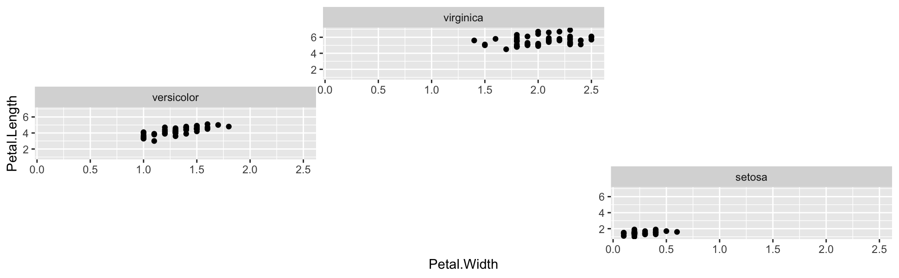
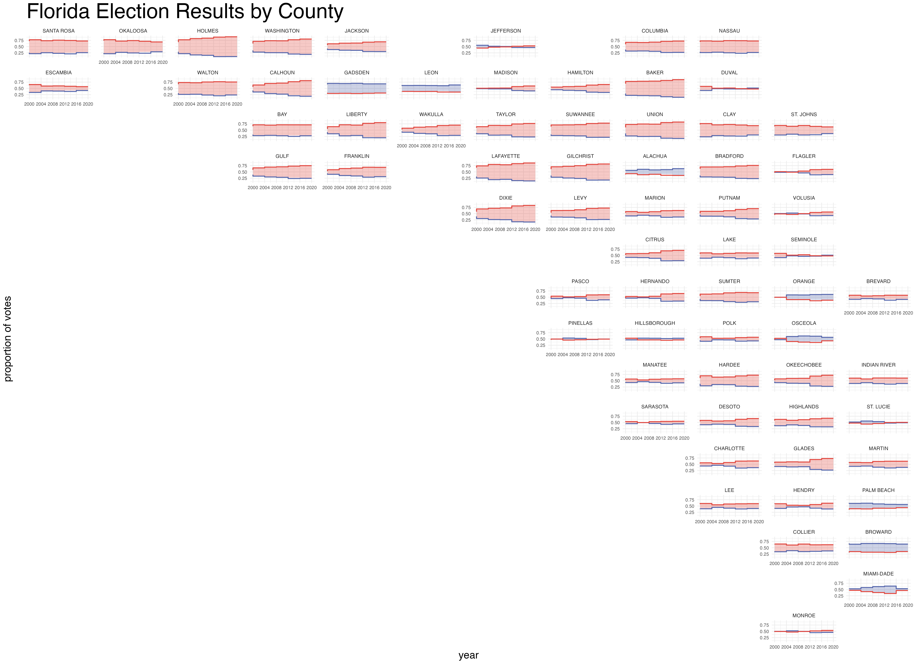

# Warp your Facets with facetwarp 

## Introduction

*facetwarp* is an extension of [*ggplot2*](https://ggplot2.tidyverse.org), specifically aimed at assisting in arranging faceted plots.

Typically `facet_wrap` positions your facets alphabetically, but with `facet_warp` you might: 

-   layout facets as their categories appear on a map 🗺 
-   arrange facets as if they themselves are points in a 2D scatter plot ⠞


# Table of contents

1.  [How it Works](#howitworks)
2.  [Installation](#installation)
3.  [Usage Examples](#examples)
4.  [Comparison to geofacet](#geofacet)
5.  [How to Contribute](#contributing)
6.  [See Also](#seealso)

## How it Works <a name="howitworks"></a>

`facetwarp` uses a solution to the [Linear Assignment Problem](https://en.wikipedia.org/wiki/Assignment_problem) developed by [Jonker & Volgenant](https://link.springer.com/article/10.1007/BF02278710) to take facets which can be expressed some 2D space, and snap them to a regular grid.

## Installation <a name="installation"></a> {#installation}

```r        
devtools::install_github("mattdzugan/facetwarp")
```

## Usage Examples <a name="examples"></a>

### Hello facet_warp 🪄
Try it out! (note the **warp** not **wrap** after the `facet`) ✨


```r         
library(ggplot2)
library(facetwarp)
ggplot(iris)+
    geom_point(aes(x=Petal.Width, y=Petal.Length))+
    facet_warp(vars(Species), macro_x='Sepal.Width', macro_y='Sepal.Length', nrow = 3, ncol = 3)
```


`facet_warp` has re-positioned the facets!
In fact, they are arranged to mimic the values of the Species' respective `Speal.Width` and `Speal.Length`:

* `virginica` at the top due to its high `median_Sepal.Length`
* `versicolor` at the left due to its low `median_Sepal.Width`
* `setosa` at the lower-right due to its low `median_Sepal.Length` and high `median_Sepal.Width`


### A more interesting example:

```r
library(dplyr)
library(ggplot2)
library(facetwarp)


elections <- read.csv(file='https://gist.githubusercontent.com/mattdzugan/bf5bc48fad1850af59ac83a411f8c0d6/raw/8da67b51df907508f7c859fe29fc4637397513d8/County_Election_Data.csv')

ggplot(elections %>% filter(state_po == 'FL'))+
  labs(title='Florida Election Results by County', 
       y='proportion of votes')+
  theme_minimal()+
  theme(legend.position = 'None',
        panel.spacing = unit(1.2, "lines"), 
        axis.title = element_text(size = 18), 
        plot.title = element_text(size = 36), 
        axis.text = element_text(size = 8))+
  geom_rect(aes(xmin=year-4, xmax=year, ymin=(1-candidate_votes/total_votes), ymax=candidate_votes/total_votes, fill=party, alpha=candidate_votes/total_votes>.5))+
  geom_step(aes(x=year, y=candidate_votes/total_votes, color=party), direction='vh', linewidth=0.8)+
  scale_alpha_manual(values=c(0,0.3))+
  scale_color_manual(values=c('#5768ac','#e24a41'))+
  scale_fill_manual(values=c('#5768ac','#e24a41'))+
  scale_x_continuous(limits=c(2000,2020), breaks = seq(2000,2020,4))+
  facet_warp(vars(county_name),
             macro_x = 'lon',
             macro_y = 'lat',
             ncol = 12, nrow = 15)
```


Note the familiar shape of the state of Florida, since we used `lat` and `lon` as our `macro` variables.

## Isn't this the same as geofacet? <a name="geofacet"></a>

The idea of `facetwarp` is similar to that of [geofacet](https://hafen.github.io/geofacet/), providing a few additional benefits: 

-   The grid-arrangement is computed automatically given numerical data (such as `lat` and `lon`) - which unlocks the potential to create beautiful arrangements on **ANY SET OF DATA** 
-   Since the arrangements are computed automatically, they are not limited to geospatial arrangements, but can use any numerical dimensions.

## How to Contribute <a name="contributing"></a>

This repo is just a brand new baby, so please [open an issue](https://github.com/mattdzugan/facetwarp/issues), or reach out on [twitter... i mean.. x](https://twitter.com/MattDzugan).

## See Also <a name="seealso"></a>

-   [geofacet](https://hafen.github.io/geofacet/) - R Package for beautiful hand-curated layouts
-   [Linear Assignment Problem](https://en.wikipedia.org/wiki/Assignment_problem)
-   [Jonker & Volgenant](https://link.springer.com/article/10.1007/BF02278710)
