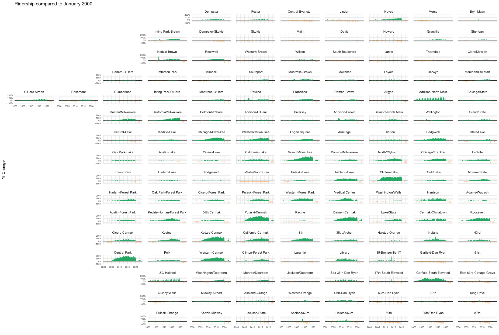

```{r, include = FALSE}
knitr::opts_chunk$set(
  collapse = TRUE,
  comment = "#>"
)
```

*facetwarp* is an extension of the [*ggplot2*](https://ggplot2.tidyverse.org) specifically aimed at arranging faceted plots.

The main function within the `facetwarp` package is `facet_warp`, which is a close sibling of [ggplot2::facet_wrap](https://ggplot2.tidyverse.org/reference/facet_wrap.html), hence the similar name. 
If you're not already familiar with how to use [ggplot2::facet_wrap](https://ggplot2.tidyverse.org/reference/facet_wrap.html), please start there.

Before you go any further, you should already be familiar with This allows you to 'speak' a graph from composable elements, instead of being limited to a predefined set of charts.


## Part 1: wrap vs warp 🪄

### wrap

First let's recall what `facet_wrap` gives us using the `iris` dataset. 👇
```{r setup}
library(ggplot2)

ggplot(iris) +
  geom_point(aes(x=Petal.Width, y=Petal.Length))+
  facet_wrap(vars(Species),nrow = 2)
```

Note that there are 3 facets, one for each species, and they are arranged in alphabetical order.
Because we've arranged them into 2 rows, and there are only 3 facets, the 4th panel (lower, right) is not occupied.

### warp
Now, we know that we've got other columns in this dataset, specifically `Sepal.Width` and `Sepal.Length`.
Let's explore those axis quickly by summarizing their values by `Species`

```{r}
library(dplyr, warn.conflicts = FALSE)

ggplot(iris %>% 
            group_by(Species) %>% 
            summarize(median_Sepal.Width  = median(Sepal.Width),
                      median_Sepal.Length = median(Sepal.Length)))+
    geom_text(aes(x=median_Sepal.Width, y=median_Sepal.Length, label=Species))
```

In our facetted scatter plot above, instead of arranging the facets alphabetically, 
maybe we want the layout to mimic this `Sepal.Length` and `Sepal.Width` arrangement we see above.

**IT IS TIME TO ✨ WARP THE FACETS  🪄 **


```{r}
library(facetwarp)
ggplot(iris)+
    geom_point(aes(x=Petal.Width, y=Petal.Length))+
    facet_warp(vars(Species), macro_x='Sepal.Width', macro_y='Sepal.Length', nrow = 3, ncol = 3)
```

👆 Notice the layout has changed. `facet_warp` has repositioned the facets!
In fact, they are mimicing the arrangement we saw above:
* `virginica` at the top due to its high `median_Sepal.Length`
* `versicolor` at the left due to its low `median_Sepal.Width`
* `setosa` at the lower-right due to its low `median_Sepal.Length` and high `median_Sepal.Width`

This was accomplished using our **macro** axes.
When we say `macro_x='Sepal.Width'`, we're saying, make no change to the "x axis" of the individual facets, but in order to arrange the facets themselves, treat `Sepal.Width` as the x-dimension.

Since we only need 4 panels total, we can try dropping `nrow` and `ncol` to `2` to condense the arrangement:
```{r}
ggplot(iris)+
    geom_point(aes(x=Petal.Width, y=Petal.Length))+
    facet_warp(vars(Species), macro_x='Sepal.Width', macro_y='Sepal.Length', nrow = 2, ncol = 2)
```


## Part 2: Building on the Warp Idea with Election Data
Let's get familiar with a bit of US Presidential Election Data.
```{r}
elections <- read.csv(file='https://gist.githubusercontent.com/mattdzugan/bf5bc48fad1850af59ac83a411f8c0d6/raw/8da67b51df907508f7c859fe29fc4637397513d8/County_Election_Data.csv')
elections <- elections %>% mutate(log_pop_density = log10(pop_density))
head(elections)
```

In the US, the two primary parties are the `DEMOCRAT` and `REPUBLICAN` parties, we can analyze the margin that these parties have over one another in each county.
But rather than just viewing the counties alphabetically, let's arrange the counties by variables that matter.

### The More Facets, The Bigger the Insights

We can try to `warp` the facets by characteristics that may impact voter tendancies.
Specifically this time:
```{r, eval=FALSE}
facet_warp(vars(county_name),
             macro_x = 'log_pop_density',
             macro_y = 'med_age')
```

let's see it in context

```{r, out.width="100%", fig.width=11,fig.height=11}
ggplot(elections %>% filter(state_po == 'CA'))+
  labs(title='California Election Results by County', 
       subtitle = 'Older Counties appear Higher, Denser Counties appear further Right',
       y='proportion of votes')+
  theme_minimal()+
  theme(legend.position = 'None',
        panel.spacing = unit(1.2, "lines"),
        axis.text = element_text(size = 6))+
  geom_rect(aes(xmin=year-4, xmax=year, ymin=(1-candidate_votes/total_votes), ymax=candidate_votes/total_votes, fill=party, alpha=candidate_votes/total_votes>.5))+
  geom_step(aes(x=year, y=candidate_votes/total_votes, color=party), direction='vh', linewidth=0.8)+
  scale_alpha_manual(values=c(0,0.3))+
  scale_color_manual(values=c('#5768ac','#e24a41'))+
  scale_fill_manual(values=c('#5768ac','#e24a41'))+
  scale_x_continuous(limits=c(2000,2020), breaks = seq(2000,2020,4))+
  facet_warp(vars(county_name),
             macro_x = 'log_pop_density',
             macro_y = 'med_age')

```


### Leaving Empty Space to Reveal Geometries
We can also take advantage of this mechanism to sort the facets geographically.
In fact, if we play with the `nrow` and `ncol` a bit, we can even get something that starts to resemble the State of California
```{r, out.width="100%", fig.width=11,fig.height=11}
ggplot(elections %>% filter(state_po == 'CA'))+
  labs(title='California Election Results by County', 
       y='proportion of votes')+
  theme_minimal()+
  theme(legend.position = 'None',
        panel.spacing = unit(1.2, "lines"),
        axis.text = element_text(size = 6))+
  geom_rect(aes(xmin=year-4, xmax=year, ymin=(1-candidate_votes/total_votes), ymax=candidate_votes/total_votes, fill=party, alpha=candidate_votes/total_votes>.5))+
  geom_step(aes(x=year, y=candidate_votes/total_votes, color=party), direction='vh', linewidth=0.8)+
  scale_alpha_manual(values=c(0,0.3))+
  scale_color_manual(values=c('#5768ac','#e24a41'))+
  scale_fill_manual(values=c('#5768ac','#e24a41'))+
  scale_x_continuous(limits=c(2000,2020), breaks = seq(2000,2020,4))+
  facet_warp(vars(county_name),
             macro_x = 'lon',
             macro_y = 'lat', 
             nrow = 12, ncol = 6)

```

Note the "blue" counties along that Western Pacific Coast of California!

This happens because our underlying algorithm is attempting to fit the 58 counties in `12*6=72` possible grid spaces.  
This leaves 14 unused spaces which means we'll begin to see the underlying shape of the `macro_x` and `macro_y` data.

## Part 3: Chicago Transity Authority Data

Another fun example is sorting train station data geographically.

```{r}
ridership <- read.csv('https://gist.githubusercontent.com/mattdzugan/603d4ba67f29457e2f5ddcad27178e8c/raw/efc26e77b39685eece11b051fbabbc74adad2ba0/CTA_Ridership.csv')
```

```{r, out.width="100%", fig.width=16,fig.height=12, eval=FALSE}
ggplot(ridership[complete.cases(ridership), ])+
  theme_minimal()+
  theme(legend.position = 'None',
        panel.spacing = unit(1.2, "lines"))+
  labs(title="Ridership compared to January 2000", ylab='% Change', xlab='')+
  geom_hline(aes(yintercept=0))+
  geom_area(aes(x=month, y=ifelse(avg_weekday_rides>avg_weekday_rides_initial, avg_weekday_rides/avg_weekday_rides_initial-1,0)), fill="#27b376")+
  geom_area(aes(x=month, y=ifelse(avg_weekday_rides<avg_weekday_rides_initial, avg_weekday_rides/avg_weekday_rides_initial-1,0)), fill="#f9a73e")+
  scale_y_continuous(limits=c(-1, 2))+
  facet_warp(vars(stationame), macro_x = 'lon', macro_y = 'lat', nrow=16, ncol=13)
```



Here we can clearly see the spatial patterns in ridership gains in a way that simple alphabetical sorting wouldn't allow.
